<div align="center">


# MEMO

**A private notebook for one person, running entirely on your own Cloudflare account.**

Pages · Pages Functions · D1 — no server to babysit, no third party holding your notes,
and small enough to live comfortably inside Cloudflare's Free plan.

</div>

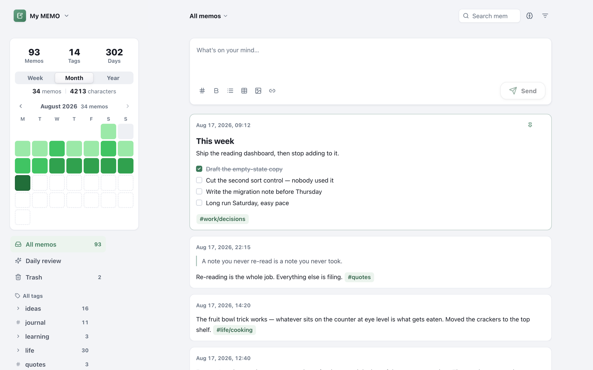

<sub>Every screenshot on this page is the real build, captured against a demo notebook of fictional memos.</sub>

---

## Contents

- [What MEMO is](#what-memo-is)
- [A tour](#a-tour)
  - [Capture](#capture)
  - [Markdown that stays plain text](#markdown-that-stays-plain-text)
  - [Tags that behave like folders — without being folders](#tags-that-behave-like-folders--without-being-folders)
  - [Search: keyword first, meaning second](#search-keyword-first-meaning-second)
  - [The model lives on your device](#the-model-lives-on-your-device)
  - [Daily review](#daily-review)
  - [Statistics](#statistics)
  - [Share a memo as a card](#share-a-memo-as-a-card)
  - [Dark, small, and bilingual](#dark-small-and-bilingual)
- [How it works](#how-it-works)
- [Getting started](#getting-started)
- [Deploying to Cloudflare](#deploying-to-cloudflare)
- [Configuration](#configuration)
- [Security](#security)
- [Storage and Free-plan limits](#storage-and-free-plan-limits)
- [Tests and project layout](#tests-and-project-layout)

---

## What MEMO is

MEMO is a single-owner notebook: one passcode, one notebook, one account. It is the
kind of app you deploy once and then forget is infrastructure.

- **Yours alone.** Your notes live in your own D1 database. With one secret set, they
  are sealed with AES-256-GCM before they ever reach it, so a database dump holds
  ciphertext and nothing else.
- **Instant after the first visit.** Every device keeps an encrypted snapshot of the
  notebook in IndexedDB. A page load is one incremental sync, not a full download —
  the same whether the notebook holds 90 memos or 9,000.
- **Finds notes by meaning, without sending them anywhere.** An optional embedding
  model runs in your browser through WebAssembly. Keyword hits always come first;
  memos that merely *mean* the same thing are added underneath.
- **Shaped for the Free plan.** No R2, no queues, no cron. Images are compressed in
  the browser and stored in D1. Reads are cheap, writes are budgeted.

---

## A tour

### Capture

The composer sits at the top of the feed and stays out of the way. Type, tag,
send. Tag autocomplete offers the paths you already use, so a notebook does not
quietly grow three spellings of the same idea.

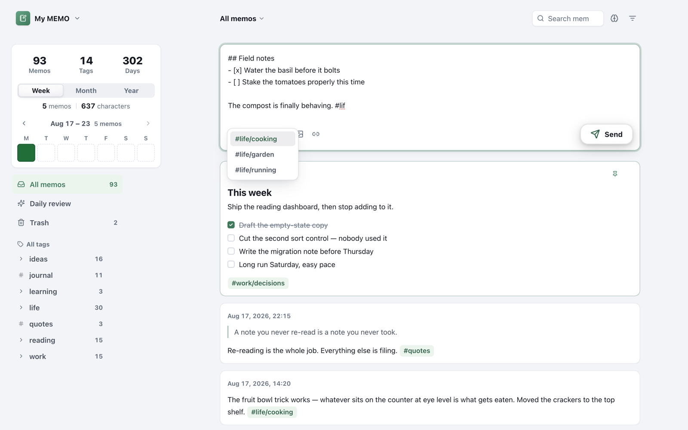

Images arrive by picking, pasting, or dragging — up to nine per memo. They are
resized to 1600px on the longest edge and compressed to WebP (JPEG as a fallback)
in the browser before upload, so a photo costs kilobytes rather than megabytes.
External image URLs are rendered remotely and cost no storage at all.

### Markdown that stays plain text

Memos render per-line Markdown: `#`–`###` headings, bullet and numbered lists with
nesting, `- [ ]` task checkboxes you can tick from the card, `>` quotes, `---`
dividers, tables, and inline **bold**, *italic*, ~~strikethrough~~, ==highlight==,
`code`, and `[links](https://example.com)` — with `#tags` still clickable inside
styled text.

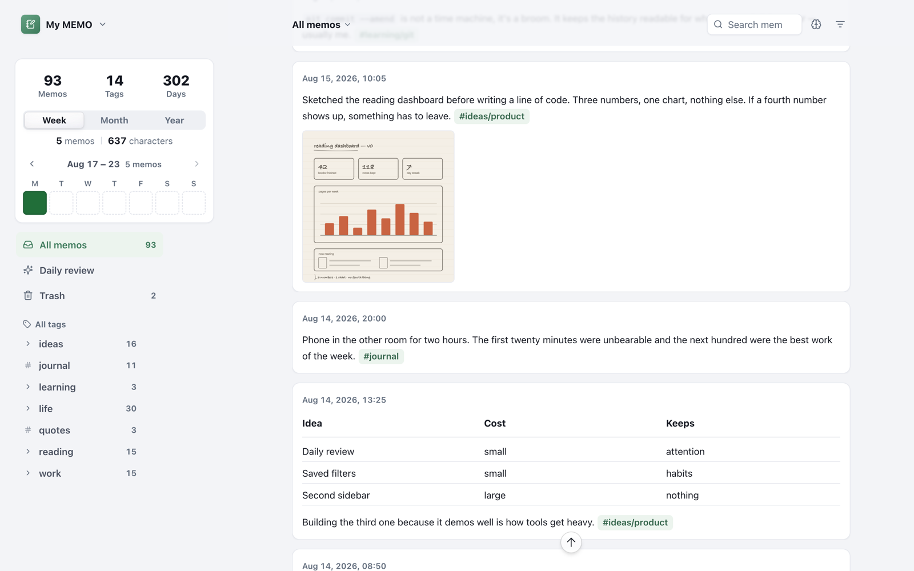

The composer helps you write it and then gets out of the way: <kbd>Enter</kbd>
continues a list (and exits on an empty item), tables are built row by row,
<kbd>Tab</kbd>/<kbd>Shift</kbd>+<kbd>Tab</kbd> indent lists and hop between table
cells, and <kbd>⌘B</kbd> / <kbd>⌘I</kbd> / <kbd>⌘E</kbd> / <kbd>⌘⇧S</kbd> /
<kbd>⌘⇧H</kbd> wrap the selection. What gets stored is still plain text, so nothing
about sync, search, or encryption has to know Markdown exists.

### Tags that behave like folders — without being folders

Write `#life/cooking` and the hierarchy appears. Navigate by breadcrumb, pin the
paths you use daily (they get a quiet rail in the margin rather than a badge in the
row), and rename or remove a tag everywhere at once — a bounded, resumable rewrite
that syncs to your other devices.

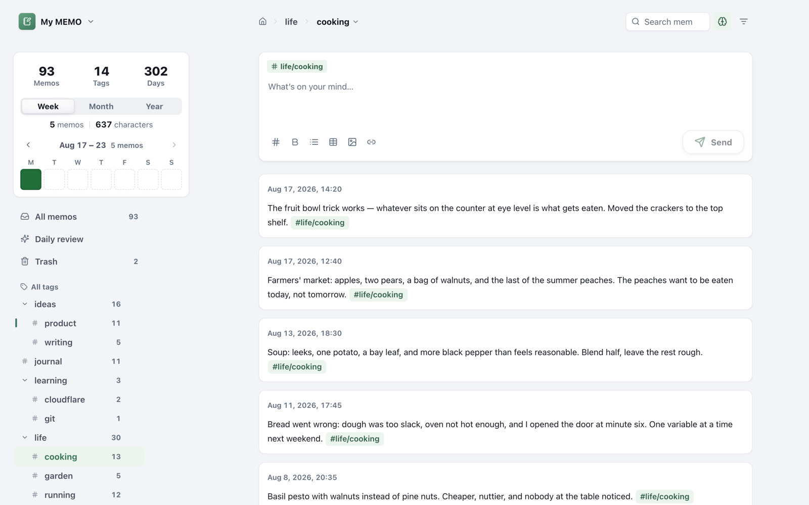

### Search: keyword first, meaning second

Space separates keywords (all must match); `"quotes"` match an exact phrase.
Structured filters narrow further — no tags, with images, with links, with open
tasks, plus a date range — and any combination can be saved as a named filter.

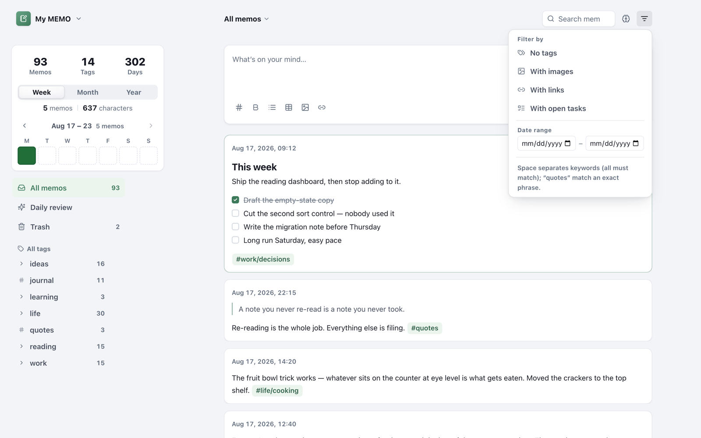

Turn on the brain toggle beside the search box and the same query also finds memos
related by meaning. Searching **fruit** returns the memo that says "fruit" first,
then the farmers' market note about apples, pears and peaches — which never uses
the word.

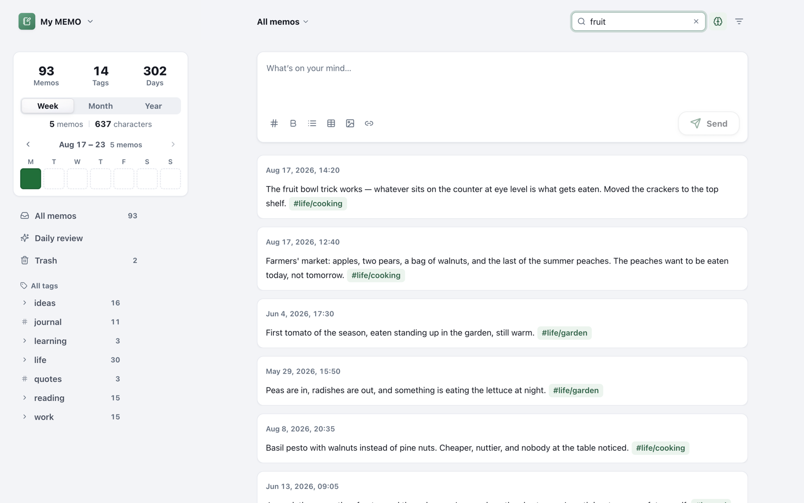

The ranking is deliberately two-tier: a keyword hit scores `2 + similarity`, a
semantic-only hit scores its raw similarity, and results are sorted descending. A
memo you can name by its words can therefore **never** be pushed below a memo the
model merely likes. Similarity is cosine, floored at `0.74`, capped at 200 results,
and narrowed by whatever tag, day, or filter the view is already showing.

### The model lives on your device

The embedding model is IBM Granite Embedding 97M Multilingual R2 (52 languages, 384
dimensions), quantized to about 123 MB across four files. It is downloaded once from
a pinned Hugging Face revision, each file checked against a SHA-256 hash baked into
the app, and executed through same-origin WebAssembly.

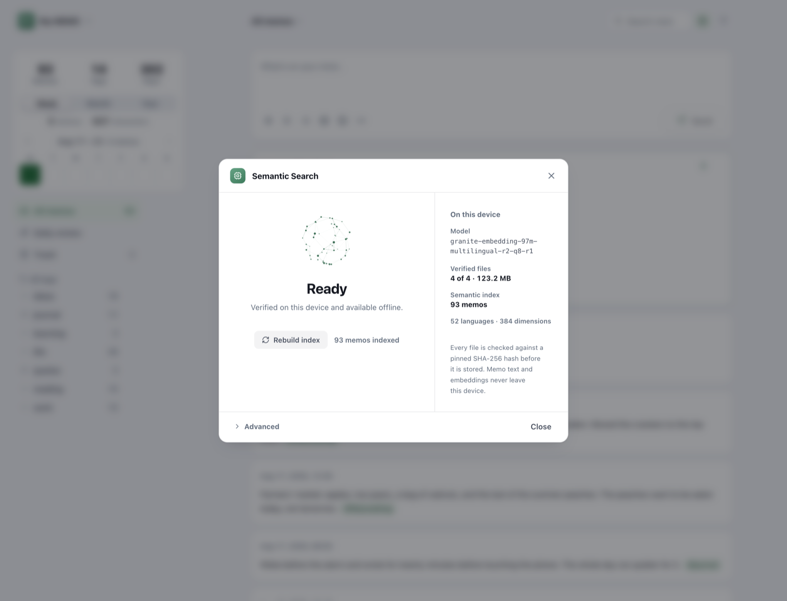

No memo text ever leaves the device. The vector index is derived from your memos, so
it is sealed with the same server-held key as the local snapshot; logging out deletes
both. For offline or air-gapped machines, the panel can export each verified file and
import it again on another device by content hash. Keyword search keeps working
throughout, whether the model is downloading, missing, or turned off.

### Daily review

A per-day sample of your own notebook, drawn on the device and frozen for the day —
no streaks, no score, nothing to keep up with. Choose the scope (all, include or
exclude tags, untagged), a time range, and how many memos to draw.

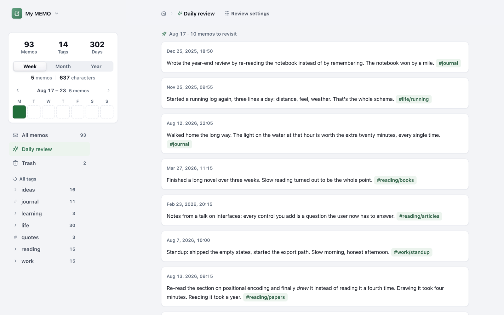

### Statistics

The sidebar carries the running totals and a heatmap that follows the week / month /
year selector and pages backwards period by period. The full view adds monthly
activity, weekday and time-of-day distributions, top tags, and streaks.

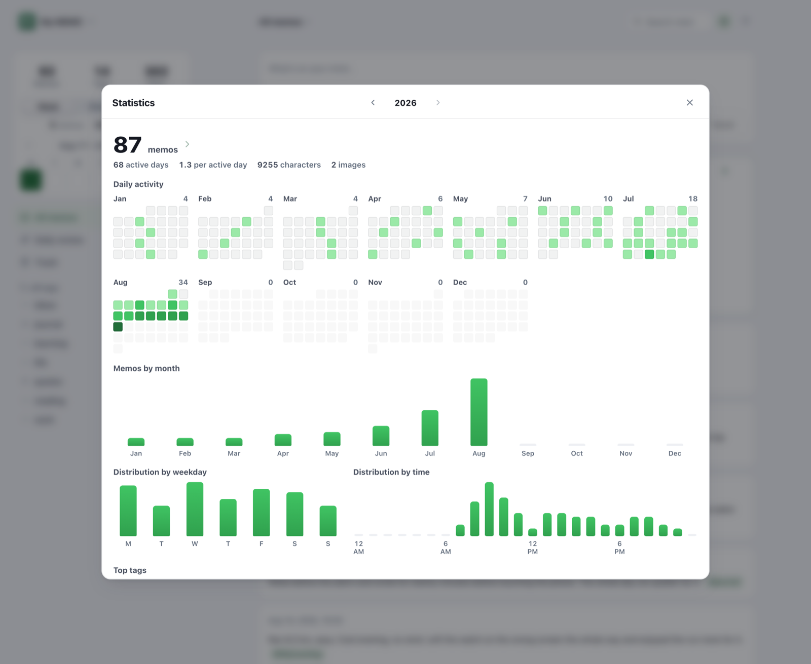

All timestamps are stored in UTC and rendered in the reader's local time zone.

### Share a memo as a card

Portrait or landscape, cream or cool gray, typeset or handwritten, with or without
the dateline and seal. The card is rendered in the browser — copy it to the clipboard
or save the PNG.

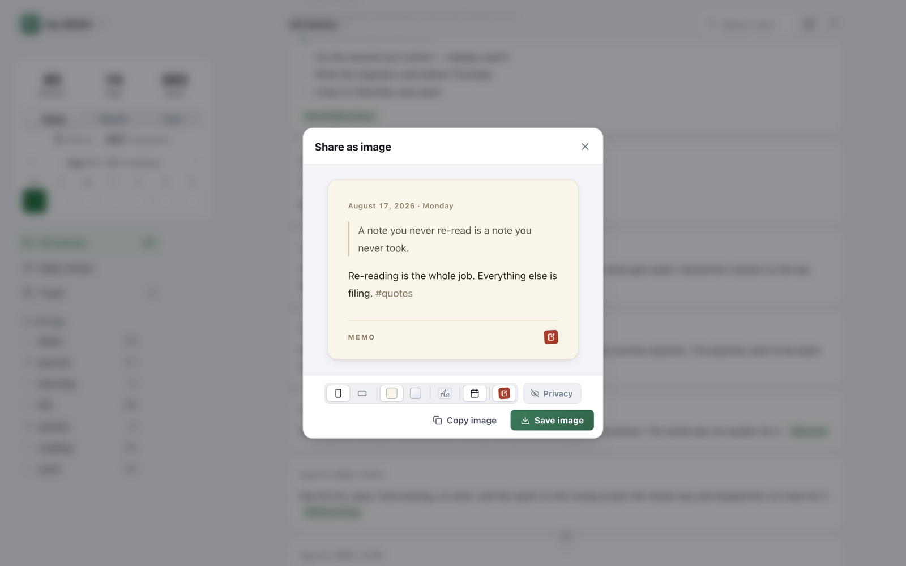

### Dark, small, and bilingual

Light, dark, or follow the system. English or Simplified Chinese, remembered per
browser. The layout collapses to a single column with a drawer on phones.

<p align="center">
  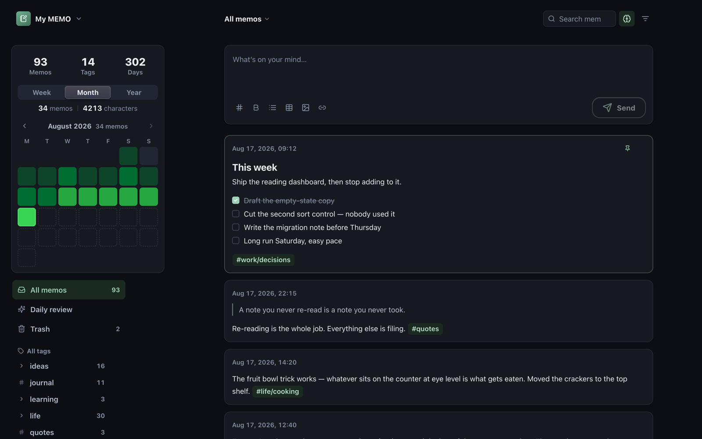
  &nbsp;
  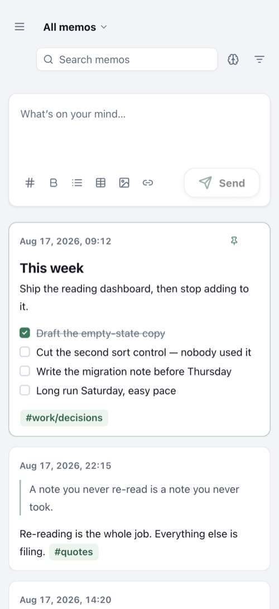
</p>

Deleting a memo moves it to Trash with its attachments intact; permanent deletion
leaves only a small tombstone so other devices learn about it. The whole notebook —
Trash, inline images, and pinned tags included — exports to a readable JSON file and
imports back, skipping ids that already exist.

---

## How it works

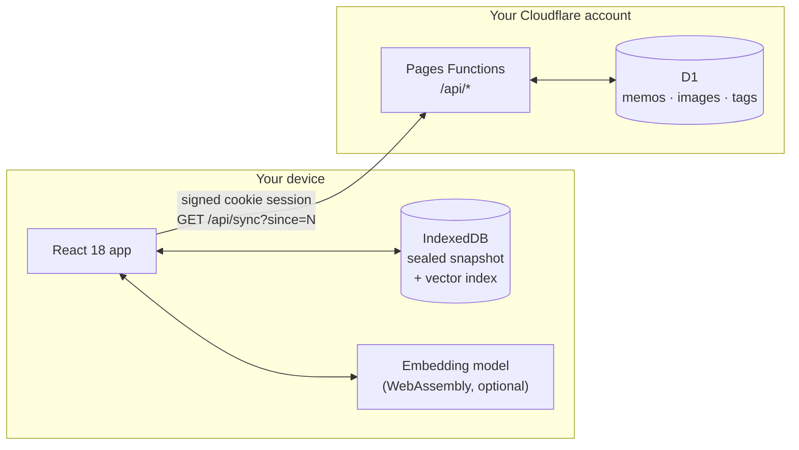

**One sequence for everything.** Every synchronized memo or tag mutation claims a
globally increasing `seq`. Clients merge responses by entity version and pull
`GET /api/sync?since=N` after local writes, when the window regains focus, and every
60 seconds. Tabs in the same browser share a single network pull through Web Locks
and hand each other the delta over `BroadcastChannel`.

**The snapshot is ciphertext.** The IndexedDB snapshot is sealed with a random key
that lives server-side and is only handed out on authenticated responses. A device
without a valid session stores nothing it can read; an explicit logout deletes the
snapshot, the vector index, and the local workspace state.

**Content encryption is optional but one-way.** With `MEMO_ENC_KEY` set, memo text is
sealed with AES-256-GCM before it reaches D1 (`enc1:` prefix, ~28 bytes plus base64
overhead per memo) and opened only at the API boundary. Rows written before the key
existed are sealed gradually in the background. Images are deliberately left unsealed
to avoid ~33% extra storage. **Never change the key once data exists** — sealed rows
only open with the key that sealed them, and content APIs fail closed rather than
treat ciphertext as editable text.

**Workspace state stays local.** Sort order, saved filters, review settings and the
frozen review batch are per-device furniture in `localStorage`; they are outside the
sync pipeline by design and are cleared by an ordinary logout.

---

## Getting started

Requirements: Node.js 20.19+, 22.13+, or 24+, and a Cloudflare account (Wrangler
authentication is only needed for remote setup and deployment).

```bash
npm install
cp .dev.vars.example .dev.vars
npm run db:migrate:local
npm run pages:dev
```

Set a long, random `SESSION_SECRET` in `.dev.vars` before starting the local Pages
server; the app is then at <http://localhost:8788>. On the first visit it asks you to
create a passcode of 4–18 digits, which is stored (hashed) in the local D1 database
and survives dev-server restarts. To exercise encryption locally, also set
`MEMO_ENC_KEY` to 64 hex characters, e.g. from `openssl rand -hex 32`.

The unauthenticated in-app setup endpoint is restricted to loopback hosts — public
deployments must be provisioned with `APP_PASSWORD_HASH` instead.

## Deploying to Cloudflare

The Pages project must exist before Pages secrets can be added, and deployment-specific
identifiers stay in a local `wrangler.toml` that Git ignores on purpose. Start from the
public template and replace every placeholder:

```bash
cp wrangler.example.toml wrangler.toml
```

Fill in your Pages project name, D1 database name and `database_id`, and set
`CANONICAL_HOST` and `PRODUCTION_PAGES_HOST` to the deployment's real hostnames. Keep
the D1 binding named `DB`. Never commit the completed file.

Then, once per deployment:

```bash
npm install
npx wrangler login

npx wrangler d1 create <your-private-database-name>   # copy database_id into wrangler.toml
npm run db:migrate:remote

npx wrangler pages project create <your-private-project-name> --production-branch main

openssl rand -hex 32                                  # paste at the prompt
npx wrangler pages secret put SESSION_SECRET

npm run hash-password -- "<your-numeric-passcode>"    # paste the whole output at the prompt
npx wrangler pages secret put APP_PASSWORD_HASH

npm run deploy
```

Later releases are `npm run deploy`, plus `npm run db:migrate:remote` when a new
migration file exists.

<details>
<summary><strong>Pages routing and cache notes</strong></summary>

The build intentionally contains `assets/404.html` and no root `404.html`, so Pages
returns a real `404` for a missing `/assets/*` file while keeping its SPA fallback for
application routes. `/assets/*` must stay in the `exclude` list in
`public/_routes.json` so hashed assets are served directly by Pages instead of
invoking Functions. The repository deliberately leaves `Cache-Control` unset so Pages
stays responsible for its status-specific cache policy.

Keep Pages' default cache headers on both the `pages.dev` hostname and any custom
domain. In the custom domain's zone, remove Cache Rules that force a browser TTL for
this project, or configure them to respect origin headers — a zone-level rule can
override the repository's `_headers` behaviour, and no repository check can make an
externally forced cache policy safe.
</details>

<details>
<summary><strong>Restoring a backup into the same D1 database</strong></summary>

Migration `0004_sync_integrity.sql` creates a random `sync_epoch` for the database
history, so a freshly bound D1 database is detected even if its numeric sync counter
has already passed a sleeping device's cursor. If you deliberately restore an older
backup into the same database, rotate the epoch once afterwards so connected clients
discard snapshots from the replaced history:

```sql
UPDATE sync_counter SET sync_epoch = lower(hex(randomblob(16))) WHERE id = 1;
```

The same migration gives every memo an explicit `content_format`, conservatively
classifying legacy rows whose stored value begins with `enc1:` as encrypted. If an old
plaintext memo literally began with those five characters, set only that row's
`content_format` back to `plain` before enabling encryption. Never touch genuine
encrypted rows.
</details>

## Configuration

| Name | Where | Required | What it does |
| --- | --- | --- | --- |
| `SESSION_SECRET` | Pages secret / `.dev.vars` | Yes | Signs the session cookie. Long and random. |
| `APP_PASSWORD_HASH` | Pages secret | Public deployments | Initial passcode hash from `npm run hash-password`. Once a passcode is set or changed in the app, the D1 value wins. |
| `MEMO_ENC_KEY` | Pages secret / `.dev.vars` | No | 64 hex characters. Enables AES-256-GCM encryption of memo content at rest. Cannot be rotated after data exists. |
| `CANONICAL_HOST`, `PRODUCTION_PAGES_HOST` | `wrangler.toml` | Deployment | The deployment's real hostnames, used for origin checks. |
| `DB` | `wrangler.toml` binding | Yes | The D1 database binding. |

## Security

- Passcodes are hashed with PBKDF2-HMAC-SHA-256 — random 16-byte salt, 100,000
  iterations. The plaintext passcode is never stored.
- Session cookies are HMAC-SHA-256 signed and set `HttpOnly`, `Secure`,
  `SameSite=Lax`, with a 30-day maximum age.
- Changing the passcode increments the session generation: every other device is
  signed out immediately, and the current device gets a fresh session.
- The passcode hash and session generation live in one `auth_state` row. Setup is a
  single-winner insert and changes are conditional updates, so concurrent
  setup/login/change requests cannot mint a cookie against mismatched state.
- State-changing requests carrying an `Origin` header are rejected when it does not
  match the app. Responses ship a restrictive CSP plus clickjacking, MIME-sniffing and
  `noindex` protections.
- Data and image APIs return `401` until the session is authenticated.
- Encryption at rest protects the database layer — dumps, backups, the D1 console — not
  someone who controls the Cloudflare account itself.
- `.dev.vars` and `wrangler.toml` are ignored by Git. Never commit them, session
  secrets, passcode hashes, or exported notebook data.
- A numeric passcode is a lightweight gate for a personal notebook. For a publicly
  discoverable or higher-risk deployment, put Cloudflare Access or an equivalent
  authentication layer in front of it.

## Storage and Free-plan limits

Images are compressed in the browser to WebP (JPEG fallback), limited to 1600px on the
longest edge and 900 KB per file, and stored base64-encoded in D1 — so no R2 bucket is
required. A memo holds up to nine stored images and 40,000 characters. External HTTPS
image links are displayed remotely and consume no storage.

Cloudflare's Free plan currently includes 5 million D1 rows read per day, 100,000 rows
written per day, 5 GB of D1 storage per account, and a 500 MB maximum per database —
see the official [D1 pricing](https://developers.cloudflare.com/d1/platform/pricing/)
and [D1 limits](https://developers.cloudflare.com/d1/platform/limits/) pages for
current values. Base64 inflates binary size by about a third, so a 900 KB image costs
roughly 1.2 MB before database overhead; watch D1 storage if the notebook is
image-heavy.

## Tests and project layout

```bash
npm test      # Node unit suite, then the Workers suite on a real workerd + D1
npm run build # type-check, production build, and the Pages output verifier
```

The Workers suite starts a temporary local `workerd` process and applies every
migration to an isolated D1 binding, so migrations are exercised on every run.

```
functions/api/   Pages Functions: auth, memos, images, tags, sync, export/import
migrations/      D1 schema history (0001 … 0005)
src/components/  Feed, composer, sidebar, dialogs, share card, semantic panel
src/lib/         Sync, cache, search, tags, Markdown, stats, model loader/runtime
tests/           Unit and DOM tests   ·   tests-workers/  runtime + migration tests
docs/            Embedding-model hosting design, screenshots
```

Hosting design for the embedding model — mirrors, CORS, and the immutable release
that backs manual import — lives in
[`docs/embedding-model-hosting.md`](docs/embedding-model-hosting.md).
